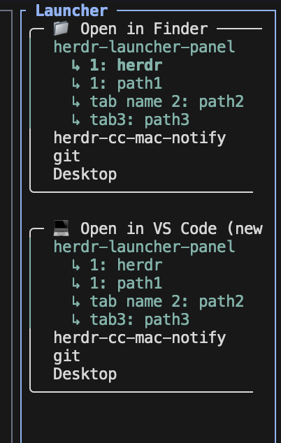

# herdr-launcher-panel

A [Herdr](https://herdr.dev) plugin: a docked panel that collects whatever
commands you configure. "Open in Finder / Explorer" and VS Code are built
in by default — add your own commands on top.

Every workspace is listed nested under each command; click one to run it
against that workspace. No more breaking away from your agent to open a
separate window and remember or type out a command.



Workspace labels aren't paths, so hovering a row shows its actual directory
on the bottom line before you click.

## Install

```bash
herdr plugin install y-hirakaw/herdr-launcher-panel
```

## Open the panel

Bind a key to the `open` action:

```toml
[[keys.command]]
key = "prefix+o"
type = "plugin_action"
command = "launcher-panel.open"
description = "open Finder/VS Code panel"
```

Calling the action again while the panel is already open opens a second
one rather than focusing the existing pane — known rough edge, not fixed
yet.

## Customize the menu

"Open in Finder/Explorer/File Manager" is fixed (there's only ever one per
OS). Everything else comes from `menu.json` in the plugin's config directory
(`herdr plugin config-dir launcher-panel`), seeded with a VS Code entry the
first time the panel runs. Edit or replace it freely:

```json
[
  {"title": "💻 Open in VS Code (new window)", "command": ["code", "-n", "{cwd}"]},
  {"title": "🌐 Open in Browser", "command": ["open", "-a", "Google Chrome", "{cwd}"]}
]
```

Each `command` is an argv list, not a shell string — no quoting needed, and
each element is passed through exactly as one argument (so `"Google Chrome"`
stays one argument, spaces and all). `{cwd}` and `{workspace_id}` are
replaced with the clicked workspace's directory and Herdr workspace ID at
click time — useful for calling `herdr` itself, e.g.
`["herdr", "workspace", "rename", "{workspace_id}", "renamed"]`. Changes
take effect within a few seconds, no reload needed. An invalid file falls
back to the VS Code default and shows why at the top of the panel.

`menu.json` runs whatever you put in it — treat it like your shell profile,
not a sandboxed setting. The first time you click a given command (any
workspace), the panel shows exactly what it's about to run and asks for
confirmation; after that, that specific command runs immediately with no
further prompt. Adding a new command to `menu.json` gets its own first-run
confirmation, independent of ones you've already approved.

## Requirements

- Python 3 (preinstalled on macOS; on Windows, needs `python3` on `PATH` —
  true for the Microsoft Store distribution, not guaranteed for every
  python.org install)
- macOS, Linux, and Windows are all declared, but only macOS has been
  actually run and clicked through. Windows in particular is untested:
  mouse support through `windows-curses` may behave differently on
  Windows Terminal / conhost than it does on a Unix pty.
